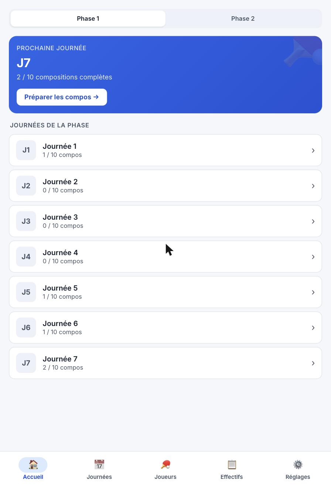
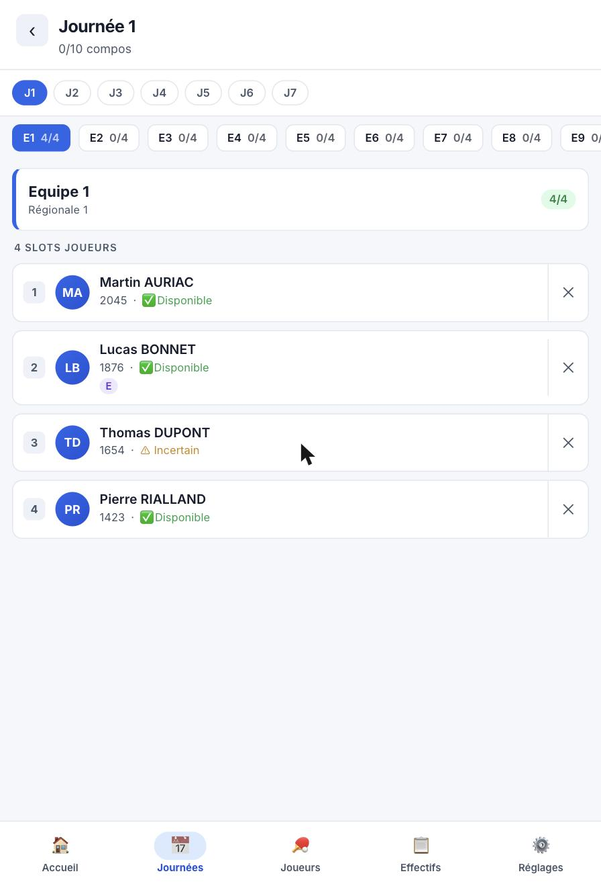
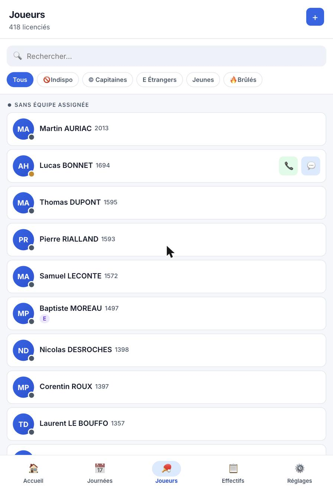
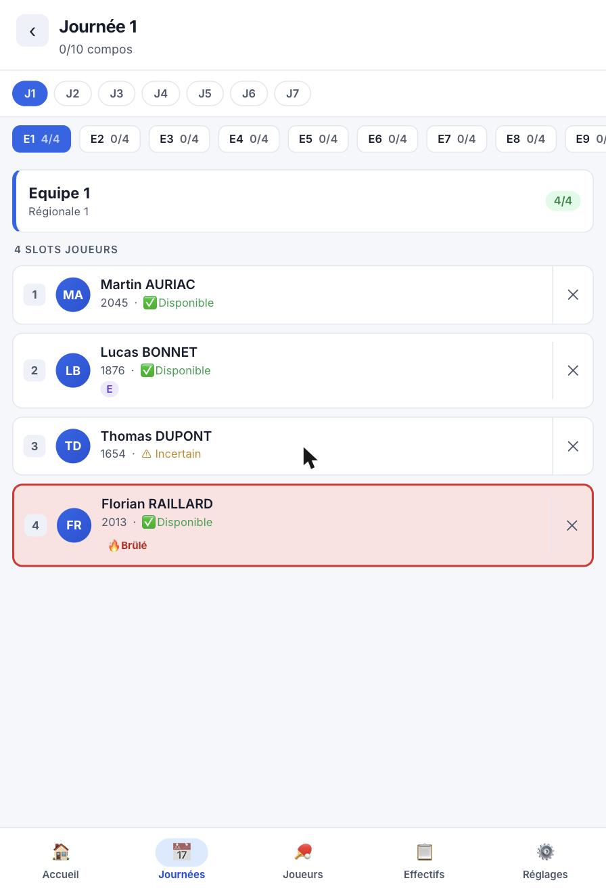

# TT Team Planner

Plugin WordPress pour gérer les compositions d'équipes d'un club de **tennis de table** sur une saison de championnat par équipes.

Développé par l'**US Talence Tennis de Table** (Nouvelle-Aquitaine), il implémente les règles de brûlage FFTT en vigueur dans la ligue.

---

## Fonctionnalités

- 📋 **Compositions par journée** — assignation des 4 slots joueurs par équipe et par journée
- 🔥 **Brûlage en temps réel** — calcul automatique des règles 2 et 3 (FFTT II.112.1) à chaque saisie
- 📅 **Disponibilités** — chaque joueur renseigne ses disponibilités (dispo / indispo / incertain)
- 👥 **Effectifs par phase** — ventilation des joueurs dans les équipes pour chaque demi-saison
- 🔄 **Synchronisation FFTT** — import des licenciés depuis le plugin Mon Club TT
- 📱 **Application mobile (PWA)** — installable sur iOS et Android, fonctionne hors ligne
- 🌙 **Mode sombre** — thème clair/sombre

---

## Captures d'écran

| Tableau de bord | Compositions |
|:-:|:-:|
|  |  |

| Liste des joueurs | Joueur brûlé |
|:-:|:-:|
|  |  |

---

## Architecture

```
tt-team-planner/
├── tt-team-planner.php          # Point d'entrée WordPress
├── assets/
│   ├── js/app.js                # SPA vanilla JS (zéro dépendance)
│   ├── css/style.css            # Styles globaux
│   ├── manifest.json            # Manifeste PWA
│   └── service-worker.js        # Cache shell + API offline
└── includes/
    ├── Plugin.php               # Bootstrap & DI
    ├── Activator.php / Deactivator.php
    ├── Admin/
    │   ├── SettingsPage.php     # Interface de configuration
    │   └── SyncPage.php         # Synchronisation manuelle
    ├── Domain/
    │   ├── Player.php           # Entité joueur
    │   ├── BurnageChecker.php   # Règles de brûlage FFTT
    │   ├── BurnageStatus.php    # Résultat (ok / rule2 / rule3)
    │   ├── Availability.php
    │   ├── MatchAppearance.php
    │   ├── PhaseSquad.php
    │   └── TeamComposition.php
    ├── Repository/
    │   ├── MatchAppearanceRepository.php
    │   └── TeamCompositionRepository.php
    ├── Rest/
    │   ├── PlayersController.php         # GET /ttp/v1/players
    │   ├── AvailabilityController.php    # GET|POST /ttp/v1/availability
    │   ├── TeamsController.php           # GET|POST|DELETE /ttp/v1/compositions
    │   ├── PhaseSquadController.php      # GET|POST|DELETE /ttp/v1/phase-squads
    │   ├── MatchAppearanceController.php # GET|POST|DELETE /ttp/v1/appearances
    │   ├── SyncController.php            # POST /ttp/v1/players/sync
    │   └── SeasonController.php          # POST /ttp/v1/season/reset
    └── Front/
        ├── Assets.php                   # Enqueue + wp_localize_script
        └── StandaloneTemplate.php       # Template page standalone
```

### SPA côté client

L'interface est une **Single Page Application vanilla JS** (aucun framework, aucun build step) rendue dans `#ttp-app`. Elle fonctionne selon un cycle état → rendu → événement :

```
S (state)  →  render()  →  DOM
     ↑                        │
     └──── attachEvents() ←───┘
```

Le state (`S`) est un objet JS simple. Toute modification passe par `setState(patch)` qui déclenche un nouveau rendu.

---

## API REST

Base : `/wp-json/ttp/v1/`

| Méthode | Endpoint | Description |
|---------|----------|-------------|
| `GET` | `/players` | Liste de tous les licenciés |
| `GET` | `/players/{id}` | Détail d'un joueur |
| `PATCH` | `/players/{id}` | Mise à jour téléphone / notes |
| `POST` | `/players/sync` | Import depuis Mon Club TT (FFTT) |
| `GET` | `/availability` | Disponibilités `?season=&phase=` |
| `POST` | `/availability` | Déclarer une disponibilité |
| `GET` | `/compositions` | Compositions `?season=&phase=&round=` |
| `POST` | `/compositions` | Assigner un slot joueur |
| `DELETE` | `/compositions` | Retirer un joueur d'un slot |
| `GET` | `/phase-squads` | Effectifs d'une phase |
| `POST` | `/phase-squads` | Affecter un joueur à une équipe |
| `DELETE` | `/phase-squads` | Retirer de l'effectif |
| `POST` | `/phase-squads/ventilate` | Ventilation automatique |
| `GET` | `/appearances/validate` | Statut de validation d'une journée |
| `POST` | `/appearances/validate` | Valider une journée (génère les apparences) |
| `DELETE` | `/appearances/validate` | Annuler une validation |
| `GET` | `/burnage` | Statut de brûlage pour une liste de joueurs |
| `POST` | `/season/reset` | Réinitialisation d'une saison |

---

## Règles de brûlage (FFTT II.112.1)

Le plugin implémente les deux règles de brûlage applicables en championnat par équipes format 4 joueurs.

> Ces règles sont appliquées dans `BurnageChecker.php` en se basant sur les `MatchAppearance` (apparences validées) enregistrées en base.

### Règle 2 — Plafonnement par équipe

Un joueur ayant disputé **2 rencontres ou plus** au cours d'une phase dans une équipe de rang N (ou inférieur) **ne peut plus jouer dans une équipe de rang supérieur à N** pour le reste de la phase.

Le rang d'une équipe est déduit de son code (ex. `T1` → rang 1, `T3` → rang 3). Plus le numéro est petit, plus l'équipe est forte.

**Exemple :**
- J1 : Florian joue en Équipe 1 (T1)
- J2 : Florian joue en Équipe 2 (T2)
- J3 : le plafond est `max(rang joué) = 2` → Florian est brûlé pour toute équipe de rang > 2 → 🔥 ne peut plus jouer qu'en T1 ou T2

### Règle 3 — Limite J2 (montée de niveau)

À la **2e journée** d'une phase, une équipe ne peut aligner **plus d'un joueur** ayant joué la 1re journée dans une équipe de rang inférieur (plus forte).

**Exemple :**
- J1 : Luc joue en T1, Marc joue en T1
- J2 : si Luc est déjà aligné en T2, Marc ne peut pas l'être → ⚠ Limite J2

### Affichage dans l'UI

| Badge | Signification |
|-------|---------------|
| 🔥 Brûlé | Règle 2 déclenchée |
| ⚠ Limite J2 | Règle 3 déclenchée |
| Fond rouge + bordure épaisse | Joueur brûlé ou indisponible dans un slot |

Le statut est recalculé côté serveur après chaque modification de composition (invalidation du cache local + rechargement via `/burnage`).

---

## Prérequis

- PHP **8.1** ou supérieur
- WordPress **6.4** ou supérieur
- Plugin **[Mon Club TT](https://github.com/robinos33/MonClubTT)** pour la synchronisation des licenciés FFTT

---

## Installation

### Développement

```bash
cd wp-content/plugins
git clone <url-du-repo> tt-team-planner
cd tt-team-planner
composer install
```

Activer le plugin depuis l'interface WordPress, puis configurer les équipes dans **Réglages → TT Team Planner**.

### Production

Télécharger la release, décompresser dans `wp-content/plugins/`, activer depuis l'administration WordPress.

---

## Configuration

Depuis **WP Admin → TT Team Planner → Réglages** :

| Paramètre | Description |
|-----------|-------------|
| Nom du club | Affiché dans l'en-tête de l'app |
| Saison | Ex. `2024-2025` |
| Phase active | Phase 1 (sept–janv) ou Phase 2 (févr–juin) |
| Équipes | Code, nom, division, couleur pour chaque équipe |
| Dates des journées | 7 dates par phase |

---

## Application mobile (PWA)

L'application est installable sur mobile via le bandeau d'installation intégré :

- **Android / Chrome** : bouton "Installer" → prompt natif du navigateur
- **iOS / Safari** : instructions "⎙ Partager → Sur l'écran d'accueil"

Une fois installée, l'app fonctionne en mode **hors ligne** (cache shell CSS/JS + cache des dernières données API).

---

## Tests

```bash
# PHP
composer test

# PHP — unitaires uniquement
composer test:unit

# PHP — avec couverture
composer test:coverage

# JavaScript
npm install && npm test
```

---

## Licence

GPL v2 or later — voir [LICENSE](https://www.gnu.org/licenses/gpl-2.0.html)
